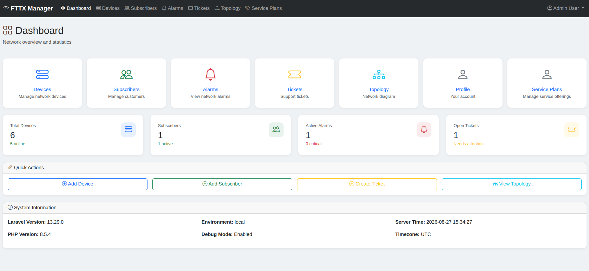
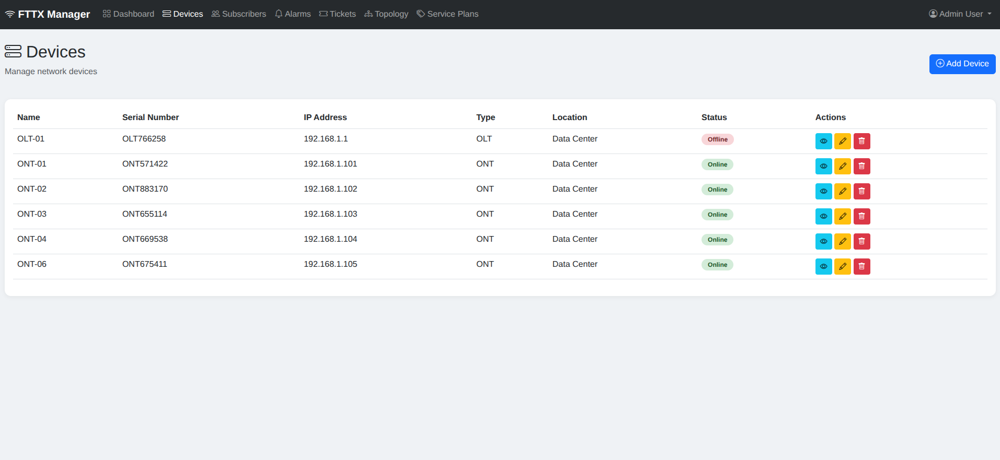
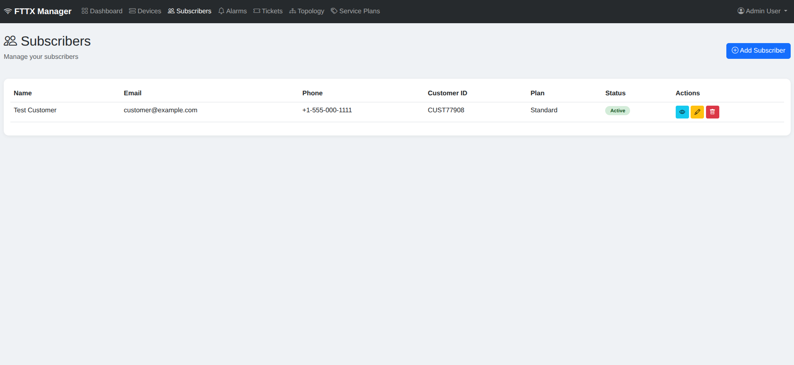
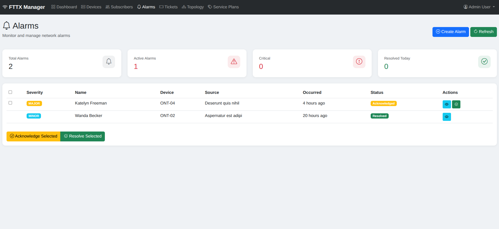
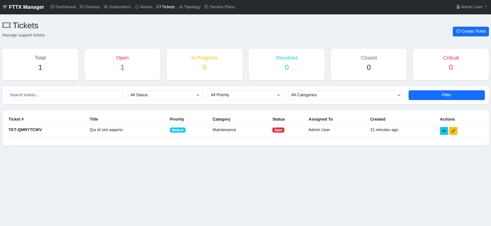
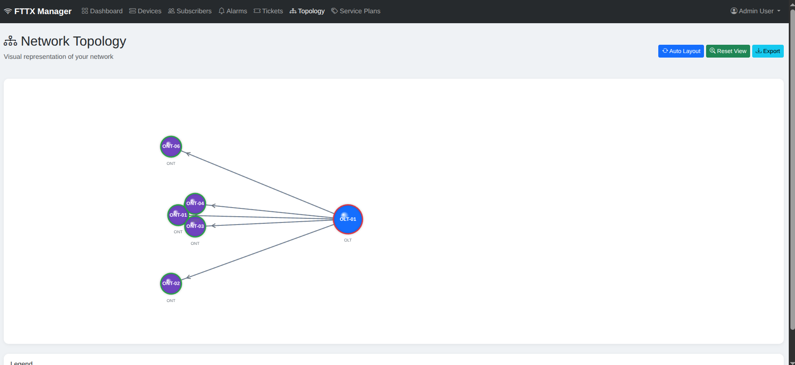
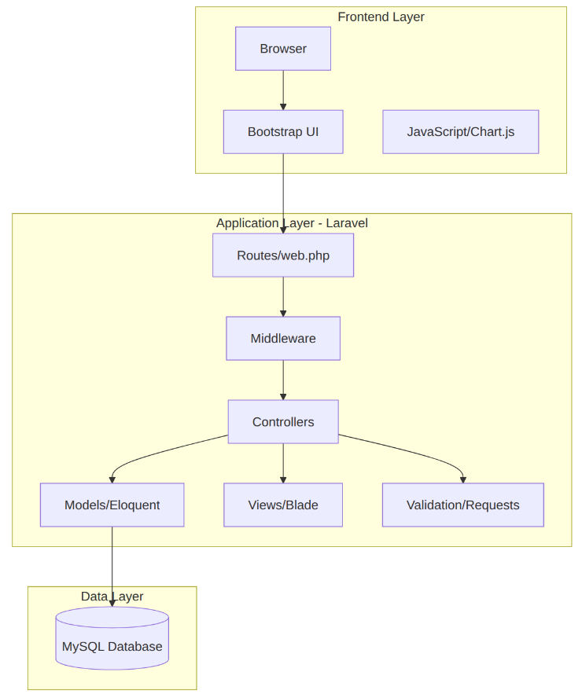
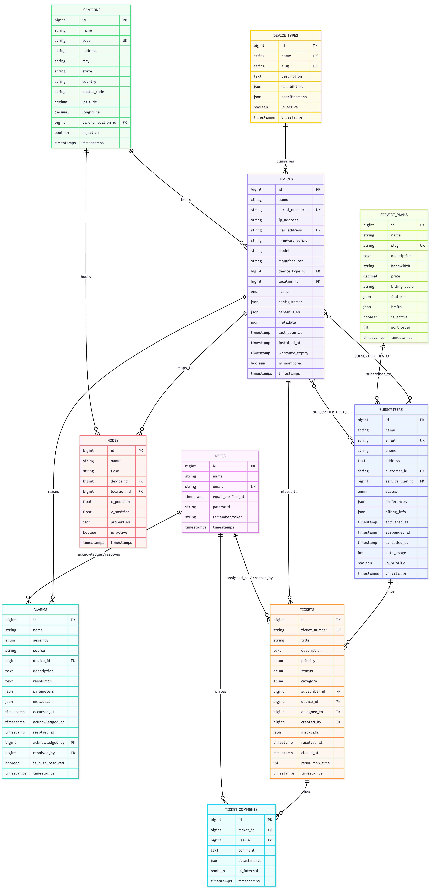

# FTT Management

A web-based **FTTx (Fiber-to-the-x) Network Management System** built with Laravel. It helps ISPs and network operators manage subscribers, devices, service plans, network topology, alarms, and support tickets from a single dashboard.

<div style="display: grid; grid-template-columns: 1fr 1fr; gap: 20px;">
  
  
  
  
  
  

</div>


## Table of Contents

1. [Project Overview](#project-overview)
2. [Features](#features)
3. [Technology Stack](#technology-stack)
4. [System Requirements](#system-requirements)
5. [Installation & Setup](#installation--setup)
6. [Environment Configuration](#environment-configuration)
7. [System Architecture](#system-architecture)
8. [ER_Daiagram](#er_daigram)
9. [Database Setup](#database-setup)
10. [Project Structure](#project-structure)
11. [Screenshots](#screenshots)
12. [Running the Application](#running-the-application)
13. [Testing](#testing)
14. [Deployment Documentation](public/docss/deployment_docs.md)


## Project Overview

FTT Management is an internal operations tool for fiber network providers. It centralizes the day-to-day work of running a fiber network: tracking physical and logical network devices (OLTs, ONTs, splitters, switches, routers), managing subscriber accounts and the service plans they're on, visualizing the network topology (nodes and links), monitoring alarms raised by devices, and handling support tickets raised by subscribers or staff.

The application is built on Laravel 13 with Blade + Tailwind CSS + Alpine.js on the front end, and uses Laravel Breeze for authentication and Spatie Laravel Permission for role/permission management.

## Features

- **Authentication & Profile Management** —login, email verification, and profile editing (powered by Laravel Breeze).
- **Roles & Permissions** — fine-grained access control via `spatie/laravel-permission`.
- **Dashboard** — at-a-glance overview of network and operational status.
- **Device Management** — full CRUD for network devices (OLT, ONT, splitter, switch, router, etc.), including status, configuration, capabilities, and parent/child device hierarchies.
- **Subscriber Management** — full CRUD for subscribers, their service plan assignments, billing info, and linked devices.
- **Service Plans** — manage bandwidth tiers, pricing, billing cycles, features, and limits, with the ability to toggle plan status.
- **Network Topology** — visual map of network nodes and the links (fiber/copper/wireless) connecting them, with live topology data endpoint.
- **Alarm Management** — device-raised alarms with severity levels, acknowledgment/resolution workflow, bulk actions, and alarm statistics.
- **Ticketing System** — support ticket lifecycle (open → in progress → resolved → closed), assignment, comments, and status updates.
- **Locations** — hierarchical location records (sites, POPs, buildings) that devices and nodes belong to.

## Technology Stack

**Backend**
- PHP 8.3+
- Laravel 13
- Laravel Breeze (authentication scaffolding)
- Spatie Laravel Permission (permissions)
- Laravel Tinker

**Frontend**
- Blade templating
- Tailwind CSS 3
- Alpine.js
- Vite (asset bundling)

**Database**
- MySQL (default, as configured) — SQLite and PostgreSQL are also supported by Laravel's database layer

**Testing**
- PHPUnit
- Mockery
- FakerPHP

**Tooling**
- Laravel Pint (code style)
- Laravel Pail (log viewer)
- Nunomaduro Collision (error reporting)

## System Requirements

- PHP >= 8.3 with common extensions (`pdo`, `mbstring`, `openssl`, `tokenizer`, `xml`, `ctype`, `json`, `bcmath`)
- Composer >= 2.x
- Node.js >= 18 and npm
- A database server: MySQL 8+ (default), or PostgreSQL / SQLite
- Git

## Installation & Setup

1. **Clone the repository**
   ```bash
   git clone https://github.com/md-borno/FTT_Management.git
   cd FTT_Management
   ```

2. **Install PHP dependencies**
   ```bash
   composer install
   ```

3. **Install JavaScript dependencies**
   ```bash
   npm install
   ```

4. **Copy the environment file**
   ```bash
   cp .env.example .env
   ```

5. **Generate the application key**
   ```bash
   php artisan key:generate
   ```

> You can also run the bundled Composer convenience script, which performs steps 2, 4, 5, migrations, and asset build in one go:
> ```bash
> composer run setup
> ```

## Environment Configuration

Configure your `.env` file with the following key settings:

```env
APP_NAME="FTT Management"
APP_ENV=local
APP_URL=http://localhost:8000

DB_CONNECTION=mysql
DB_HOST=127.0.0.1
DB_PORT=3306
DB_DATABASE=ftt_management
DB_USERNAME=root
DB_PASSWORD=

SESSION_DRIVER=database
QUEUE_CONNECTION=database
CACHE_STORE=database
```
## System Architecture


- **`DB_CONNECTION`** can be switched to `pgsql` or `sqlite` if you prefer a different database driver — update the corresponding `DB_*` values (or point `DB_DATABASE` to a `.sqlite` file path).
- Never commit your real `.env` file or production credentials to version control.

## ER_Daigram


## Database Setup

1. **Create the database** (skip if using SQLite):
   ```sql
   CREATE DATABASE ftt_management;
   ```

2. **Run migrations** to create all tables (users, locations, device_types, devices, subscribers, service_plans, subscriber_device, alarms, nodes, links, tickets, ticket_comments, and Laravel's system tables):
   ```bash
   php artisan migrate
   ```

3. **Seed the database** with initial data (users and sample topology):
   ```bash
   php artisan db:seed
   ```
   Or combine both steps:
   ```bash
   php artisan migrate --seed
   ```

A reference entity-relationship diagram for the schema is included at `public/database.mmd` (Mermaid format).

## Project Structure

```
FTT_Management/
├── app/
│   ├── Http/Controllers/     # DashboardController, DeviceController, SubscriberController,
│   │                          # AlarmController, TicketController, TopologyController,
│   │                          # ServicePlanController, ReportController, MaintenanceController, Auth/...
│   ├── Models/                # User, Device, DeviceType, Subscriber, ServicePlan, Location,
│   │                          # Node, Link, Alarm, Ticket, TicketComment,
│   │                          # MaintenanceSchedule, PerformanceMetric, WorkOrder
│   ├── Providers/
│   └── View/
├── database/
│   ├── migrations/            # Schema definitions for every table
│   ├── seeders/                # DatabaseSeeder, UserSeeder, TopologySeeder
│   └── factories/
├── resources/
│   └── views/
│       ├── dashboard/
│       ├── devices/
│       ├── subscribers/
│       ├── service-plans/
│       ├── alarms/
│       ├── tickets/
│       ├── topology/
│       ├── auth/
│       ├── profile/
│       ├── layouts/            # app.blade.php, guest.blade.php, navigation.blade.php
│       └── components/         # shared Blade components (buttons, inputs, modal, etc.)
├── routes/
│   ├── web.php                 # application routes
│   ├── auth.php                # Breeze auth routes
│   └── console.php
├── public/
│   ├── index.php
│   └── database.mmd            # ER diagram (Mermaid)
├── tests/
│   ├── Feature/                 # incl. Auth/ feature tests, ProfileTest
│   └── Unit/
├── .env.example
├── composer.json
├── package.json
├── vite.config.js
└── tailwind.config.js
```

## Screenshots

_Screenshots are not included in this repository. Once you have the application running locally, add screenshots of the Dashboard, Devices, Subscribers, Topology, Alarms, and Tickets views here to give new contributors a quick visual overview._

## Running the Application

1. **Start the Laravel development server**
   ```bash
   php artisan serve
   ```
   The app will be available at `http://localhost:8000`.

2. **Compile front-end assets** (in a separate terminal, for local development with hot reload)
   ```bash
   npm run dev
   ```

   Or build production assets:
   ```bash
   npm run build
   ```

3. **Log in** using the credentials created by `UserSeeder`, or register a new account at `/register`.

4. Navigate to `/dashboard` to access the main application, or use the sidebar/navigation to reach Devices, Subscribers, Service Plans, Topology, Alarms, and Tickets.

## Testing

The project uses PHPUnit for feature and unit tests (authentication flow, profile management, etc.).

Run the full test suite:
```bash
php artisan test
```

Or via Composer:
```bash
composer test
```

Run a specific test file:
```bash
php artisan test --filter=AuthenticationTest
```

> Tests typically run against an in-memory SQLite database or a dedicated test database — check `phpunit.xml` and configure a `.env.testing` file if you want to isolate test data from your development database.

## Deployment

General steps for deploying to a production server:

1. **Set environment to production** in `.env`:
   ```env
   APP_ENV=production
   APP_DEBUG=false
   APP_URL=https://your-domain.com
   ```

2. **Install dependencies without dev packages**
   ```bash
   composer install --optimize-autoloader --no-dev
   npm install
   npm run build
   ```

3. **Generate an application key** (if not already set) and **run migrations**
   ```bash
   php artisan key:generate
   php artisan migrate --force
   ```

4. **Cache configuration, routes, and views** for performance
   ```bash
   php artisan config:cache
   php artisan route:cache
   php artisan view:cache
   ```

5. **Set correct permissions** on `storage/` and `bootstrap/cache/` directories so the web server can write to them.

6. **Configure a web server** (Nginx or Apache) to point to the `public/` directory, with PHP-FPM handling PHP execution.

7. **Set up a process manager** (e.g., Supervisor) if using queues (`QUEUE_CONNECTION=database` is configured by default), and schedule `php artisan schedule:run` via cron if using Laravel's task scheduler.

8. **Use HTTPS** in production and ensure `SESSION_SECURE_COOKIE` and related security settings are appropriately configured.